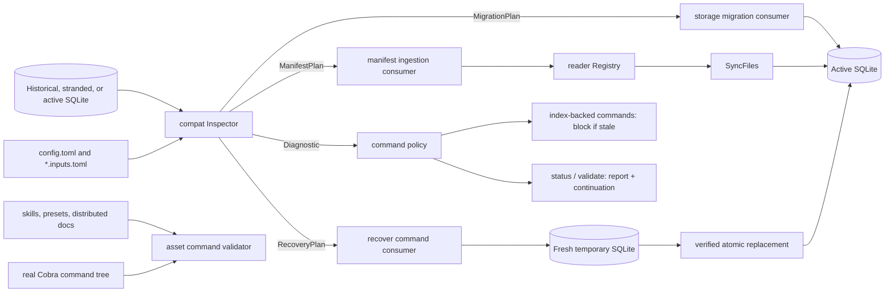

# Systemic Index Compatibility for Backscroll Issues #30–#33

**Status:** Approved design

**Date:** 2026-08-18

**Issues:** #30, #31, #32, #33

## Decision and reviewer path

Backscroll will resolve #30–#33 through one **narrow, stateless compatibility boundary** for legacy database and configuration representations. The boundary inspects inputs and returns canonical plans or typed diagnostics. It never writes, starts transactions, owns workflow state, applies business rules, or orchestrates commands. Separate consumers execute schema migration, manifest ingestion, stranded-database recovery, and shipped-asset validation.

Review and deliver the change in this order:

1. **Plan 1 — inspection and migration primitives:** confirm schema inspection is stateless, release coverage is hermetic, and migration snapshot/transaction/final verification is shape-safe. This safe intermediate slice does not block commands, print `recover`, or close #31.
2. **Plan 3 — recovery and policy activation:** confirm active-plus-one-stranded recovery is registered and functional before shared stale-index refusal, cached-fallback removal, diagnostic behavior, direct-read exemption proof, or executable continuations become user-facing.
3. **Plan 2 — manifest ingestion:** confirm manifest-only external sources and all-active preflight consume the already-active fail-closed policy, so no manifest failure can serve cached rows.
4. **Plan 4 — guidance:** confirm every shipped command resolves against the real Cobra tree, every command declares a known asset effect, and unannotated/unknown commands refuse harness execution.
5. **Closure evidence:** confirm every plan boundary is fully green with no skipped closure test; #31 closes only after Plan 2 completes both migration/policy and ingestion evidence.

This design supersedes the earlier `open-issues-triage` conclusions where they differ. In particular, the user-facing command is `backscroll recover`; recovery replaces the active database with the verified union of its existing records and one stranded source, while remaining a recovery-only operation rather than an arbitrary cross-machine or multi-source merge. Legacy `[sources]` is rejected with an exact manifest example rather than merely warned about.

## Problem statement

Four reports expose three systemic root clusters rather than four independent patches.

| Root cluster | Issues | Failure | Root correction |
|---|---|---|---|
| Index lineage compatibility | #31, #32 | Version rows do not fully describe historical schema shape; failed migration can leave an unusable or stale index; expired raw sessions make rebuild lossy. | Inspect real schema shape, migrate supported Go lineages transactionally, block stale data access, and provide atomic stranded-database recovery. |
| External-source contract | #31, #33 | Legacy `[sources]` parses without a production consumer; active manifests can declare an unregistered decoder and be skipped; the shipped decisions preset names a nonexistent command. | Make `*.inputs.toml` the only truth, register `markdown_sections`, preflight all active manifests, and reject invalid roots/manifests/decoders visibly. |
| Guidance and asset integrity | #30 | Shipped guidance can drift from executable CLI behavior and can encourage unsupported conclusions after weak recall evidence. | Validate every shipped consumer asset against the Cobra command tree and add the approved recall guardrails. |

The reported mechanisms are not treated as authoritative. For example, glob discovery already exists, while `markdown_sections` registration and visible preflight are missing. Likewise, published v0.3.18 Go DDL contains `source_metadata`, but an observed failing database may not; actual shape, not the version label alone, decides compatibility.

## Goals and non-goals

### Goals

- Upgrade every published Go schema lineage to the current schema without row loss.
- Diagnose unsupported, corrupt, or stale indexes with a non-empty executable continuation argv.
- Prevent all index-backed data commands from reading cached results after migration or sync leaves the index stale, while keeping direct file reads available and clearly non-evidentiary about index freshness.
- Keep `*.inputs.toml` manifests as the only external-source truth.
- Make Markdown decision files a normal reader input through `markdown_sections`.
- Recover the union of the configured active database and one stranded historical database into a fresh, verified active database, preserving recent active records and historical stranded records without mutating the stranded source.
- Account for every record from both recovery inputs and reject every identity conflict or uninterpretable record before replacement.
- Ensure shipped skills, presets, and distributed documentation name executable commands from the real Cobra tree.
- Close issues only with named behavior tests.

### Non-goals

- Arbitrary cross-machine merge, multiple stranded sources, synchronization, replication, or conflict resolution. The required active-plus-one-stranded recovery union is the sole merge-like operation.
- A cached-result fallback after migration or sync failure.
- Automatic mutation of `config.toml` or generation of manifests from `[sources]`.
- Dual ingestion from both `[sources]` and manifests.
- In-place migration of frozen Rust v0 databases.
- Repairing arbitrary SQLite corruption or unknown third-party schemas.
- Fixing the reported large-file index gap without a minimal reproducing fixture.
- Adding a second discovery pipeline, decoder plugin framework, migration DSL, workflow engine, or persistent compatibility state.
- Moving #30 into runtime compatibility logic; it is a shipped-asset validation concern.

## Architecture



### Responsibilities

| Component | Owns | Must not own |
|---|---|---|
| `internal/compat` | Read-only shape/config inspection; canonical plans; typed diagnostics; deterministic compatibility classification. | Writes, transactions, backups, temporary paths, atomic rename, Cobra output, retries, workflow state, business rules. |
| Storage migration consumer | Snapshot, transaction, ordered migration execution, post-migration verification. | Guessing lineage from version alone or swallowing a compatibility diagnostic. |
| Manifest ingestion consumer | Manifest loading, registry preflight, discovery, decoding, sync transaction, stale-state propagation. | Reading legacy `[sources]`, silently skipping inputs, or maintaining a second source model. |
| Recovery consumer | Resolve and de-duplicate active/stranded paths; open both inputs read-only; request a union plan; create a fresh temporary destination; import, validate, back up active, and atomically replace it. | Arbitrary cross-machine or multi-source merge semantics, partial import, stranded-source mutation, or conflict resolution. |
| Command policy | Classifying data versus diagnostic commands and enforcing blocking behavior. | Cached fallback or command-specific reinterpretation of diagnostics. |
| Asset command validator | Discovering consumer `.md`, `.toml`, and `.sh` assets under approved distribution roots; extracting commands; requiring a known effect on every root constructor; resolving/exercising against `buildRootCmd`. | Runtime index compatibility, a hand-maintained verb allowlist, or a default effect for unannotated commands. |

## Typed compatibility model

The model is intentionally small and introduced only when a real consumer needs it. Plan 1 owns only schema inspection and migration primitives:

```go
// internal/compat, introduced by Plan 1
package compat

type Code string

const (
    CodeUnsupportedLineage Code = "unsupported_lineage"
    CodeMigrationFailed    Code = "migration_failed"
    CodeIndexStale         Code = "index_stale"
)

type Diagnostic struct {
    Code         Code
    Summary      string
    Continuation []string
}

type SchemaShape struct {
    AppliedVersion int
    Signature      string
}

type MigrationStep struct { Version int; Name string }
type MigrationPlan struct { From SchemaShape; Steps []MigrationStep }

type Queryer interface {
    QueryContext(context.Context, string, ...any) (*sql.Rows, error)
    QueryRowContext(context.Context, string, ...any) *sql.Row
}

func InspectIndex(ctx context.Context, q Queryer) (MigrationPlan, *Diagnostic, error)
func VerifyCurrentShape(ctx context.Context, q Queryer) error
```

Plan 1 diagnostics are internal inspection results. They are not rendered by commands and may have an empty `Continuation`; Plan 3 fills executable argv only after `recover` exists.

```go
// introduced by Plan 3 when recovery consumes them
const (
    CodeRecoveryConflict   Code = "recovery_conflict"
    CodeUninterpretableRow Code = "uninterpretable_row"
)

type RecoveryInput struct {
    Shape    SchemaShape
    Records  []models.IndexedRecord
    RowCount int
}

type CanonicalRecord struct {
    Record      models.IndexedRecord
    PayloadHash string
}

type RecoveryPlan struct {
    InputShapes     []SchemaShape
    Records         []CanonicalRecord
    ExactDuplicates int
}

func PlanRecovery(inputs []RecoveryInput) (RecoveryPlan, []Diagnostic, error)
```

Plan 3 moves only the canonical `IndexedRecord` representation from storage to `internal/models` to avoid the real storage→compat→storage import cycle. `IndexedRecordQuery` and SQL query ownership remain in storage.

```go
// introduced by Plan 2 when manifest preflight consumes them
const (
    CodeLegacySources   Code = "legacy_sources"
    CodeInvalidManifest Code = "invalid_manifest"
    CodeUnknownDecoder  Code = "unknown_decoder"
    CodeInvalidRoot     Code = "invalid_root"
)

type ReaderLookup interface {
    ForDef(input_config.InputDefinition) (readers.SessionReader, error)
}

type ManifestPlan struct { Inputs []ResolvedInput }
type ResolvedInput struct {
    Definition input_config.InputDefinition
    ReaderName string
}

func InspectManifests(defs []input_config.LoadedDefinition, registry ReaderLookup) (ManifestPlan, *Diagnostic, error)
func InspectLegacyConfig(raw []byte) *Diagnostic
```

The recovery consumer resolves paths first and passes active then stranded as logical inputs; when `--from` resolves to active, it passes one input so rows are not scanned or counted twice. Go `error` represents inability to inspect; typed diagnostics represent observed incompatibility. Once Plan 3 activates command policy, every user-facing block carries non-empty argv that resolves through Cobra. Plans contain identifiers and ordered actions, not SQL strings, handles, callbacks, destination paths, or mutable status.

## Detailed flows

### Normal migration

1. Resolve the configured active database path.
2. Open the database for inspection and read `schema_migrations`, `sqlite_master`, `PRAGMA table_info`, index metadata, and relevant trigger definitions.
3. Match the observed signature to the published Go lineage catalog. A version row is evidence, not the sole selector.
4. If no destructive step is required, execute the returned steps in one transaction and verify the final shape before commit.
5. Before the first destructive step, create and fsync a snapshot beside the active database. Snapshot creation is a consumer responsibility and occurs before the migration transaction.
6. Execute every migration step and final-shape verification in one transaction. Any execution or verification failure rolls back every step.
7. Reopen or re-inspect the committed database. Only then may ingestion and an index-backed command continue.

A migration that is already current returns an empty plan. Re-running inspection is idempotent.

### Incompatible or stale index

1. If inspection cannot map the shape safely, Plan 1 returns internal `unsupported_lineage` without command text. After Plan 3 registers and completes `recover`, the active command policy renders non-empty argv `backscroll recover --from <resolved-actual-path> --dry-run`; diagnostics never print a literal placeholder.
2. If snapshot, migration, verification, manifest preflight, decoding, discovery, or sync fails after the current query corpus may have become stale, classify the active index as unusable for index-backed commands in that invocation.
3. Stop before index-backed search, list, pattern output, mutation, cached success output, or zero-result claims.
4. `backscroll read <file>` remains available because it reads the supplied file directly through `internal/reader`; it must never be described or tested as proof that the index is current.
5. `status` and `validate` remain available. They inspect read-only, print the primary diagnostic and any safely collectible secondary diagnostics, and print a non-empty executable continuation argv.
6. A later index-backed command performs a fresh inspection. No persistent compatibility state or cached failure flag is introduced.

### Manifest ingestion

1. Parse all installed `*.inputs.toml` files. Invalid TOML, duplicate IDs, unsupported versions, missing required fields, invalid roots, and unsafe/unknown discovery patterns are visible failures.
2. Reject any non-empty legacy `[sources]` before ingestion. Do not mutate the config and do not ingest either representation.
3. Resolve every active manifest through `readers.Registry` before discovering or syncing any file. This is an all-input preflight: one unknown decoder blocks the whole sync.
4. Register `markdown_sections` as a normal `SessionReader`. It discovers through the existing manifest discovery path, hashes deterministically, emits ordered sections, and uses whole-document fallback when no eligible section headings exist.
5. Only after all active definitions pass preflight, discover all files. An invalid or inaccessible declared root blocks sync visibly; an existing valid root with no matching files is a valid empty input.
6. Parse and validate all planned files, then invoke existing sync execution. Any failure blocks index-backed commands; no partially refreshed corpus may be presented as current. Direct file `read` remains available without making an index-freshness claim.

Legacy configuration is rejected with an exact conversion example. For example:

```toml
# Rejected legacy config.toml
[sources]
decisions = ["/work/project/docs/decisions"]
```

becomes a separate file such as `decisions.inputs.toml`:

```toml
version = 1

[[inputs]]
id = "decisions"
source = "decision"
active = true

[inputs.discover]
roots = ["/work/project/docs/decisions"]
include = ["**/*.md"]
exclude = ["TEMPLATE.md", "template.md", "Template.md"]
follow_symlinks = false

[inputs.decode]
format = "markdown_sections"
```

The diagnostic includes the actual legacy category and paths in this template. It never writes the file automatically.

### Recovery and dry-run

The command shape is:

```text
backscroll recover --from <stranded.db> [--dry-run]
```

The destination is the configured active database. Recovery builds the union of that active database and exactly one stranded database supplied by `--from`; it is not a general `--into`, cross-machine, or multi-source merge tool.

1. Resolve and canonicalize the configured active path and `--from` path. If they resolve to the same database, treat them as one logical input rather than scanning, counting, or importing it twice.
2. Open every distinct input with SQLite `mode=ro`. Each logical input is read-only during planning; stranded bytes and sidecars must remain unchanged throughout recovery.
3. Inspect each input lineage and adapt or explicitly reject every row from both inputs into the current canonical record shape.
4. Build one complete union identity/equivalence/conflict plan in memory or bounded read-only batches. Exact duplicate identities with equivalent canonical payloads collapse to one record. The same identity with different payloads is a conflict. Any conflict or uninterpretable row in either input makes the entire plan non-applicable.
5. With `--dry-run`, print the same per-input and union counts, duplicate identities, conflicts, uninterpretable records, input shapes, and intended replacement path that apply would use. Use the identical union planner and create no destination, temporary database, backup, journal, or other file.
6. Without `--dry-run`, stop immediately if planning does not account for every input row or contains any conflict or uninterpretable row.
7. Create a fresh temporary database in the active database's directory so final rename is on the same filesystem. Initialize it at the current schema; never append into the existing active database.
8. Import the verified union in one transaction and validate source accounting, union row counts, identities, foreign-key integrity, FTS consistency, schema shape, and representative queryability before commit.
9. Close all input and destination handles. Preserve the original active database as a uniquely named backup and fsync the containing directory.
10. Atomically rename the independently verified temporary database into the active path and fsync the directory again.
11. Report the active path, backup path, per-input counts, exact duplicates collapsed, and final union count. Never delete the backup automatically.

When `--from` resolves to the active path, the single logical input still follows the fresh-destination and backup flow. A failure before final replacement leaves the original active database untouched; a failure during replacement restores or retains a valid original path according to the platform-specific atomic replacement helper.

## Error precedence and command behavior

### Precedence

When more than one problem is observable, commands select the primary diagnostic in this order:

1. **Invocation/config cannot be interpreted:** invalid CLI arguments, unreadable config, invalid TOML.
2. **Parallel source truth:** non-empty legacy `[sources]`.
3. **Index cannot be trusted:** unreadable/corrupt database, unsupported lineage, failed migration, failed final-shape verification.
4. **Manifest set cannot be trusted:** unsupported manifest version, duplicate ID, unknown decoder, invalid or inaccessible root, invalid pattern.
5. **Refresh cannot be trusted:** discovery, decode, or sync failure; index is stale for this invocation.
6. **Requested operation failure:** query, read, mutation, output, or recovery execution failure.

Within one level, preserve deterministic manifest-file and input-ID order. `validate` may report all independently inspectable diagnostics, but its first item and exit classification follow this precedence. A wrong continuation is worse than a missing one, and missing is forbidden for a block: tests assert every blocking diagnostic has a non-empty argv and execute every printed continuation shape against the Cobra tree. This proves invocation, not guaranteed successful remediation.

### Command classes

| Class | Commands/surfaces | Contract when index or ingestion is incompatible/stale |
|---|---|---|
| Index-backed data reads | `search`, `list`, `patterns` | Exit non-zero before reading or printing cached rows. Print the primary typed diagnostic and non-empty executable continuation. |
| Direct file reads | `read` | Remain available because the supplied file is read directly through `internal/reader`. Output is file-decoder output only and is never presented as evidence that the index is current. |
| Data mutations | `rebuild`, `purge`, `annotate`, and automatic sync preceding another command | Exit non-zero before mutation or success output. No partial migration or sync is represented as success. |
| Diagnostics | `status`, `validate` | Remain runnable, inspect read-only, report detected shape/staleness and a non-empty executable continuation, and exit non-zero when unhealthy. They do not migrate or sync merely to diagnose. |
| Remediation | `recover` | May inspect incompatible active/stranded inputs and write only through the atomic union-recovery flow. `--dry-run` writes nothing. |
| Configuration/help | `config`, `help`, `version`, shell completion | Remain available without opening or trusting the index. |

No index-backed command serves cached results after a migration or sync failure. `--indexed-only`, robot/JSON output, source filters, or other flags do not bypass the block. Direct `read` remains available but carries no index-freshness claim. Machine-readable modes carry the same diagnostic code and non-empty executable continuation argv as human output.

## Recovery identity, conflicts, and atomicity

### Identity and equivalence

| Record state in either input | Identity key | Union comparison | Outcome |
|---|---|---|---|
| Non-empty valid UUID | UUID | Compare canonical payload hash for every active/stranded record sharing UUID. | Collapse exact duplicates to one union record; conflict if payload differs. Do not fall back to path/ordinal. |
| Empty UUID with valid source path and non-negative ordinal | Exact `(source_path, ordinal)` | Compare canonical payload hash for every active/stranded record sharing the pair. | Collapse exact duplicates to one union record; conflict if payload differs. |
| Same content hash under different identities | Each declared identity remains distinct. | Hash proves payload equivalence only. | Preserve both records; content hash never deduplicates identities. |
| Missing/invalid UUID and unusable path or ordinal | No safe identity. | Not applicable. | Uninterpretable; abort the entire union recovery. |
| Historical row cannot map required canonical data | Identity may or may not exist. | Not applicable. | Uninterpretable; abort the entire union recovery. |

`source_path` is compared exactly as stored; recovery does not normalize case, separators, symlinks, hosts, or project roots. UUID validity uses the formats actually published by Backscroll readers; it does not invent UUIDs for legacy rows.

### Atomicity invariants

- Every distinct active/stranded input is opened read-only for planning and is never migrated, vacuumed, journal-mode changed, or otherwise mutated; the stranded source remains unchanged throughout recovery.
- Planning accounts for every row from both inputs as importable, an exact duplicate, conflicting, or uninterpretable. If both paths resolve identically, one logical input is accounted once.
- The verified output is the union: recent active-only records and historical stranded-only records are both preserved; exact duplicate identities collapse.
- Any same-identity payload conflict or uninterpretable record aborts the entire recovery. There is no `--force`, `--skip`, or partial mode.
- Apply and dry-run use the same union planner and therefore produce the same plan for the same input bytes and active-path resolution.
- The temporary destination starts empty at the current schema; recovery imports the planned union and never appends into the existing active database.
- All destination inserts and database-level verification occur in one transaction.
- Replacement occurs only after transaction commit, handle closure, and independent read-only verification of the temporary destination.
- The temporary destination is created beside the active database; atomic rename never crosses filesystems.
- The original active database is preserved as a backup before replacement and is never automatically deleted.
- A failed recovery leaves either the original active path intact or a restorable backup plus an explicit diagnostic; it never reports success without the verified destination at the active path.

## Published lineage compatibility strategy

Compatibility is maintained by **unique observed schema shape**, with release ranges supplying the required corpus. The current repository has Go releases beginning at v0.3.7 and migration history through V13.

| Published release range | Language | Highest recorded migration | Required fixture strategy |
|---|---|---:|---|
| v0.1.9–v0.3.6 | Rust | Not applicable | Outside in-place migration. `recover --dry-run` may recognize explicitly supported extractable shapes; otherwise report the frozen Rust v0 boundary. |
| v0.3.7–v0.3.10 | Go | V1 | Fixture every unique V1 shape/signature from published DDL or release-produced database. |
| v0.3.11–v1.3.5 | Go | V3 | Cover V2/V3 embedding-table and column shape variants. Include the observed v0.3.18-style missing-`source_metadata` variant even though published DDL contains the column. |
| v1.4.0–v1.4.4 | Go | V4 | Cover split FTS tables, triggers, and repopulated indexes. |
| v2.0.0–v2.1.0 | Go | V5 | Cover removal of `session_events` while `source_metadata` may still vary by observed shape. |
| v2.2.0–v2.2.3 | Go | V7 | Cover conditional V6 column removal and V7 reasoning triggers. |
| v2.3.0 | Go | V8 | Cover perennity fields and `tool_events`. |
| v2.4.0–v2.5.0 | Go | V9 | Cover tool-event UUID uniqueness. |
| v2.6.0 | Go | V10 | Cover template-mining tables. |
| v2.7.0 | Go | V11 | Cover correction signals. |
| v2.8.0–v2.11.0 | Go | V12 | Cover annotations. |
| v2.12.0–v3.2.5 | Go | V13 | Cover backfill discovery indexes and current-shape idempotency through the latest confirmed published release. |

A checked-in release-to-schema manifest is the hermetic inventory of published Go releases from v0.3.7 through v3.2.5. It maps each release to a checked-in schema fixture/signature and records the source checksum or provenance needed to reproduce that classification. Multiple releases may share one fixture only when their relevant schema signatures are identical. Unit and CI tests consume only this checked-in manifest and fixtures; they do not depend on ambient/local `git tag` state or network access. The currently available local tags ending at v2.16.1 therefore cannot silently truncate coverage of the confirmed v3.0.0–v3.2.5 releases. A deliberate maintainer generation/maintenance check may compare the manifest with GitHub releases and fail when a published release is unmapped, but it is separate from hermetic tests. Version rows, tables, columns, indexes, and relevant triggers contribute to classification; irrelevant SQLite metadata does not.

Rust v0 is a format boundary, not a hidden migration branch. No Rust database is modified in place. An explicit recovery adapter may be added only for a verified Rust shape and remains subject to the same identity, conflict, dry-run, and atomic replacement rules.

## Test strategy and closure evidence

Tests use table-driven cases, `t.TempDir()`, immutable fixture copies, and focused public boundaries. Historical fixtures must come from published DDL/release binaries or documented observed shapes; tests must not teach fixtures to match current assumptions.

| Test | Behavior proved | Issue evidence |
|---|---|---|
| `TestCheckedInReleaseSchemaManifestIsComplete` | The checked-in v0.3.7–v3.2.5 release inventory maps every listed Go release to an existing checked-in fixture/signature without consulting local tags or the network. | #31 migration half |
| `TestPublishedGoLineagesUpgradeLosslessly` | Every manifest-mapped published Go shape reaches current schema with rows and FTS queryability preserved. | #31 migration half |
| `TestHistoricalLineageWithoutSourceMetadataUpgradesLosslessly` | The observed divergent shape does not fail V6 and loses no data. | #31 original upgrade symptom |
| `TestMigrationSnapshotAndRollbackOnDestructiveFailure` | Snapshot precedes destructive work; injected failure rolls back all schema/data changes. | #31 safety |
| `TestStaleIndexBlocksIndexBackedCommands` | Table-driven `search/list/patterns/rebuild/purge/annotate` cases return no cached data or mutation after migration/sync failure. | #31 blocking contract |
| `TestDirectReadRemainsAvailableButClaimsNoIndexFreshness` | `read` decodes the supplied file through `internal/reader` while the index is stale, and its output contains no index-current claim. | #31 operability boundary |
| `TestBlockingDiagnosticsHaveExecutableContinuations` | Every blocking diagnostic, including `status` and `validate` output for an unhealthy index, has non-empty continuation argv that resolves and executes through Cobra; success of the remediation itself is not assumed. | #31 operability |
| `TestLegacySourcesRejectedWithExactManifestExample` | `[sources]` causes no ingestion or config mutation and prints a complete equivalent manifest. | #31 ingestion half |
| `TestActiveManifestsPreflightBeforeSync` | Unknown decoder, invalid manifest, duplicate ID, or invalid root blocks before any input syncs. | #31, #33 |
| `TestDecisionManifestMarkdownSectionsEndToEnd` | Nested and newly added Markdown files are discovered, decoded, indexed, and retrieved with source `decision`. | #31 ingestion half, #33 |
| `TestMarkdownSectionsReaderSectionsAndWholeDocument` | Ordered section parsing and no-heading fallback are deterministic. | #33 |
| `TestRecoverDryRunMatchesUnionApplyPlanWithoutWrites` | Dry-run and apply use the identical active-plus-stranded union plan; dry-run creates or changes no files. | #32 |
| `TestRecoverUnionPreservesActiveAndStrandedRecords` | Active-only recent records and stranded-only historical records both appear in the fresh current-schema destination. | #32 |
| `TestRecoverIdentityAndConflictMatrixAcrossInputs` | UUID precedence, path/ordinal fallback, exact-duplicate collapse, hash-only equivalence, and same-identity conflicts across either input follow the table. | #32 |
| `TestRecoverConflictOrUninterpretableRollsBackEverything` | One bad row in either input prevents every import and leaves active/stranded bytes unchanged. | #32 |
| `TestRecoverSameResolvedPathIsOneInput` | `--from` resolving to the active database scans, accounts, and imports each record once. | #32 |
| `TestRecoverAtomicallyReplacesAndPreservesActiveBackup` | A fresh verified union destination replaces active atomically and the original active backup remains. | #32 |
| `TestRecoverStrandedSourceIsReadOnly` | Stranded database and sidecar metadata are byte/mtime stable across dry-run, success, and failure. | #32 |
| `TestEveryRootCommandDeclaresAssetEffect` | Root and every direct Cobra command declare exactly one known `read`, `write`, or `replace` effect; missing/unknown annotations fail. | #30 harness safety |
| `TestAssetHarnessRejectsMissingOrUnknownEffect` | The harness refuses execution before setup or command dispatch when effect metadata is absent or unknown. | #30 harness safety |
| `TestShippedConsumerAssetDiscovery` | Discovery includes shipped consumer `.md`, `.toml`, and `.sh`, including `.claude/skills/backscroll-doctor/assets/gather.sh`, while excluding only the three history trees. | #30 surface accountability |
| `TestAllShippedBackscrollCommandsAreExecutable` | Commands extracted from every discovered shipped asset resolve against `buildRootCmd` and pass the fail-closed safe harness. | #30, stale #33 preset |
| `TestShippedSearchGuidanceGuardrails` | Guidance requires ranked-hit inspection, artifact vocabulary, malformed-call handling, and explicit index-gap reproduction. | #30 |

Focused tests run before package or repository-wide suites. Integration-style CLI tests use temporary config/database roots and never a real home directory. The command-asset test reports asset path, line, parsed argv, and Cobra failure so drift is directly repairable.

### Issue closure gates

- **#31 closes only after** `TestCheckedInReleaseSchemaManifestIsComplete`, `TestPublishedGoLineagesUpgradeLosslessly` (including the missing-column fixture and V13 coverage through v3.2.5), the index-backed blocking/direct-read boundary tests, **and** the ingestion set (`TestLegacySourcesRejectedWithExactManifestExample`, `TestActiveManifestsPreflightBeforeSync`, and `TestDecisionManifestMarkdownSectionsEndToEnd`) pass.
- **#33 shares ingestion evidence** and closes only when the end-to-end decision retrieval and preflight tests pass; existing glob unit tests alone are insufficient.
- **#32 requires active-plus-stranded union fixtures**, including preservation of both record sets, exact-duplicate collapse, cross-input conflict/uninterpretable rollback, same-path de-duplication, dry-run parity, stranded-source immutability, active-backup preservation, and atomic replacement verification.
- **#30 requires complete asset discovery, explicit known effects on every root command, fail-closed rejection of missing/unknown effects, all consumer-facing commands to be executable**, not merely present as strings, plus the four guidance guardrails.

## Four reviewable delivery slices

| Slice | Scope and dependency | Review evidence | Rollback boundary | Net delta direction |
|---|---|---|---|---|
| 1. Inspector and migration primitives | Introduce schema-only compatibility types, checked-in release/schema catalog through v3.2.5, inspection, snapshot, one-transaction migration, and final verification. Do not activate command refusal or print `recover`. | Hermetic release inventory, published-lineage, divergent-shape, snapshot, rollback, and final-shape tests; no skip and no Cobra dependency. | Revert compatibility schema primitives, migration consumer changes, and fixture manifest together; leave existing DB backups untouched. | Initially positive because fixtures are new; no speculative manifest/recovery types or command-policy branches. |
| 3. Recover and blocking-policy activation | Depends on Plan 1. Introduce recovery types and canonical record ownership when consumed; build/register functional active-plus-one-stranded recovery; then activate shared index blocking, remove cached fallback, update all indexed consumers/diagnostics, and prove direct `read` remains exempt without changing it. | Full recovery invariants plus stale-index blocking, direct-read boundary, and executable-continuation tests, all passing with no skip. | Revert recover, canonical record move, policy/consumer changes, and tests as one chained slice; Plan 1 migration primitives remain safe. | Positive but narrow: one recovery path and one centralized policy; no general merge framework, flags, or persistent state. |
| 2. Manifests and Markdown reader | Depends on Plan 3’s active blocking policy. Introduce manifest-only types when consumed, reject `[sources]`, preflight every active manifest, register `markdown_sections`, and repair preset instructions. | Legacy rejection, all-input preflight, Markdown reader, end-to-end decision retrieval, and the complete no-skip #31 gate. | Revert reader registration, manifest preflight, legacy rejection, preset, and tests; Plan 3 continues to block other stale failures safely. | Neutral to negative in production code: remove/retire legacy source plumbing and silent skips; test/fixture lines increase. |
| 4. Guidance and asset command validation | Depends on final commands and repaired presets from Plans 1, 3, and 2. Discover shipped `.md`, `.toml`, and `.sh`; require explicit known effects on every root constructor; execute through a fail-closed hermetic harness. | Full shipped-asset command execution, effect-completeness/refusal tests, and four guardrail tests. | Revert guidance text, command metadata, and validator/tests together; runtime compatibility remains intact. | Neutral to negative in shipped prose; small explicit metadata/test growth prevents future drift. |

Each slice is independently reviewable and revertible. Tests ship with the behavior they prove. Net line count is reported honestly; fixture growth is not disguised, and production-code growth must be justified by deletion of duplicated branches or by an explicit new recovery capability.

## Risks and anti-overengineering constraints

| Risk | Mitigation |
|---|---|
| Version labels hide divergent shapes. | Match shape signatures and retain observed variants; never use migration number alone. |
| A migration backup exists but is unusable. | Reopen and validate snapshots in tests before destructive steps. |
| Compatibility becomes an orchestration framework. | Keep the package stateless and read-only; plans contain identifiers, not SQL, handles, callbacks, paths, or mutable status. |
| Recovery evolves into general merge/sync. | Permit only the configured active database plus one `--from` stranded source, with no `--into`, additional sources, cross-machine workflow, or conflict-resolution flags. |
| Recovery drops recent active records while restoring history. | Plan every row from both read-only inputs and import only the verified union into a fresh current-schema destination. |
| Identity collapses distinct history. | UUID first, exact path/ordinal fallback, hash only for equivalence, exact-identity duplicates collapse, and conflicting identities abort. |
| Release coverage follows a stale clone or flaky network. | Make the checked-in release/schema manifest and fixtures authoritative for hermetic tests; isolate optional GitHub comparison as deliberate maintenance. |
| Legacy and manifest inputs drift. | Reject `[sources]`; never auto-mutate or dual-ingest. |
| One bad manifest silently starves another source. | Preflight every active manifest before any sync and block visibly. |
| Diagnostic commands accidentally mutate. | Open read-only and prohibit migration/sync in `status`/`validate` health inspection. |
| Asset validation becomes a brittle text allowlist. | Discover approved `.md`/`.toml`/`.sh` roots, resolve parsed command paths and flags against the constructed Cobra tree, and exercise safe invocations. |
| A future command executes under an unsafe default effect. | Define only `read`, `write`, and `replace`; annotate every root constructor; fail completeness and harness execution for missing/unknown metadata. |
| The design grows fields for hypothetical lineages. | Add a plan field only when a consumer needs it for an approved flow and a fixture proves the need. |

Explicit constraints:

- No new daemon, cache, state file, compatibility database, state machine, plugin protocol, migration language, retry loop, or feature flag.
- No `--force`, `--skip-conflicts`, `--merge`, `--partial`, or cached-result escape hatch.
- No duplicate manifest or reader abstractions when `input_config` and `readers.Registry` already provide the boundary.
- No issue-specific branches where one typed diagnostic and one policy table cover the root class.
- No implementation for the large-file symptom until a focused fixture fails on current code.

## Alternatives considered

### Root-batched, layer-free design

This approach would patch each root directly in existing packages: conditional migration code in storage, decoder registration in command helpers, recovery code in the command, and documentation tests beside Cobra tests.

It minimizes new types and may produce fewer initial lines. It was rejected because the same legacy-shape and diagnostic decisions would be repeated across migration, ingestion, and recovery consumers. That repetition makes error precedence drift likely. The selected compatibility boundary retains the root-batched delivery order but centralizes only inspection and translation; it does not add orchestration layers.

### Issue-by-issue patches

This approach would add guidance for #30, make V6 conditional for #31, add an import/merge command for #32, and add new glob handling for #33.

It was rejected because it follows reported mechanisms rather than reproduced roots. It would duplicate glob discovery, leave `markdown_sections` and silent preflight failures unresolved, risk closing only half of #31, and create a general merge surface beyond stranded recovery. Four issues do not justify four unrelated patches when two root clusters are shared.

### Dual `[sources]` and manifest ingestion

Rejected because it creates two representations of external-source truth, ambiguous precedence, and permanent migration burden. An exact rejection example is simpler and safer than automatic mutation.

### Cached reads with warnings

Rejected because stale indexed results look authoritative and can produce false absence claims. Diagnostics and direct file `read` remain available; stale indexed data does not.

### Source-only replacement, in-place recovery, or partial import

Source-only replacement is rejected because it would discard recent records that exist only in the configured active database. In-place mutation removes the safest rollback boundary, and partial success makes accounting non-deterministic. The selected flow reads active plus one stranded source, constructs a fresh current-schema database from their verified union, preserves the original active backup, never mutates the stranded source, and atomically replaces only after complete verification.

## Acceptance checklist

### Architecture and behavior

- [ ] `internal/compat` is stateless and performs no writes, transactions, orchestration, backups, or path replacement.
- [ ] Migration, ingestion, recovery, and asset validation remain separate consumers.
- [ ] Actual schema shape, not only migration rows, selects a plan.
- [ ] Destructive migration snapshots first, then executes and verifies in one transaction.
- [ ] The checked-in release/schema manifest maps every published Go release through v3.2.5 to a tested signature, and hermetic tests require neither local tags nor network access.
- [ ] Frozen Rust v0 is outside in-place migration.
- [ ] Index-backed data commands block after incompatible migration or stale sync; no flag enables cached fallback.
- [ ] Direct `read` remains available through `internal/reader` and is never presented as proof that the index is current.
- [ ] Every blocking diagnostic, including `status` and `validate`, carries a non-empty executable continuation argv; invocation does not imply guaranteed remediation success.
- [ ] `*.inputs.toml` is the only external-source truth.
- [ ] Legacy `[sources]` is rejected with an exact manifest example and no automatic mutation.
- [ ] `markdown_sections` is a registered normal reader.
- [ ] Every active manifest is preflighted before any sync begins.
- [ ] Unknown decoder, invalid manifest, or invalid/inaccessible declared root blocks visibly.
- [ ] Recovery resolves the configured active database plus one stranded `--from` source, treats an identical resolved path as one input, and opens every distinct input read-only for planning.
- [ ] Recovery accounts for every row from both inputs, preserves active-only and stranded-only records, and collapses only exact duplicate identities with equivalent payloads.
- [ ] Recovery uses UUID first, exact `(source_path, ordinal)` fallback, and content hash only for equivalence.
- [ ] Any same-identity conflict or uninterpretable record in either input aborts and rolls back everything.
- [ ] Recovery builds a fresh current-schema destination, verifies the union, atomically replaces active, preserves the original active backup, and never mutates the stranded source.
- [ ] `--dry-run` uses the same union planner and performs no writes.
- [ ] Shipped consumer discovery includes `.md`, `.toml`, and `.sh`, including `.claude/skills/backscroll-doctor/assets/gather.sh`, and excludes only `docs/roadmap`, `docs/research`, and `docs/superpowers`.
- [ ] Root and every current root command constructor explicitly declares one canonical `read`, `write`, or `replace` effect; the harness has no default and refuses missing/unknown values.
- [ ] Every command in discovered shipped skills, presets, scripts, and distributed docs is executable against the real Cobra tree.
- [ ] The large-file symptom remains out of implementation scope until reproduced.

### Issue closure matrix

| Issue | Required closure evidence | Must remain open when |
|---|---|---|
| #30 | `TestShippedConsumerAssetDiscovery`, `TestEveryRootCommandDeclaresAssetEffect`, `TestAssetHarnessRejectsMissingOrUnknownEffect`, `TestAllShippedBackscrollCommandsAreExecutable`, and `TestShippedSearchGuidanceGuardrails` pass across all shipped consumer assets. | Any shipped extension/root is omitted, any command effect is missing/unknown/defaulted, any invocation is merely string-matched rather than executable, or any guardrail is absent. |
| #31 | Hermetic checked-in release inventory through v3.2.5, published-lineage/divergent-shape migration, index-backed blocking, direct-read boundary, executable-continuation, legacy rejection, manifest preflight, and Markdown ingestion end-to-end tests pass. | Only migration or ingestion is fixed, `read` is incorrectly blocked, a blocking argv is empty/non-executable, or release coverage depends on local tags/network. |
| #32 | Active-plus-stranded union preservation, exact-duplicate collapse, same-path de-duplication, cross-input identity/conflict handling, dry-run parity, stranded-source immutability, full rollback, active-backup preservation, and atomic replacement fixtures pass. | Recovery drops either input's unique records, can skip/partially import, mutates stranded source, duplicates the same resolved input, or expands into arbitrary database merge. |
| #33 | `TestActiveManifestsPreflightBeforeSync` and `TestDecisionManifestMarkdownSectionsEndToEnd` pass, sharing #31 ingestion evidence. | Only existing glob discovery is demonstrated or the preset still names a nonexistent command. |
